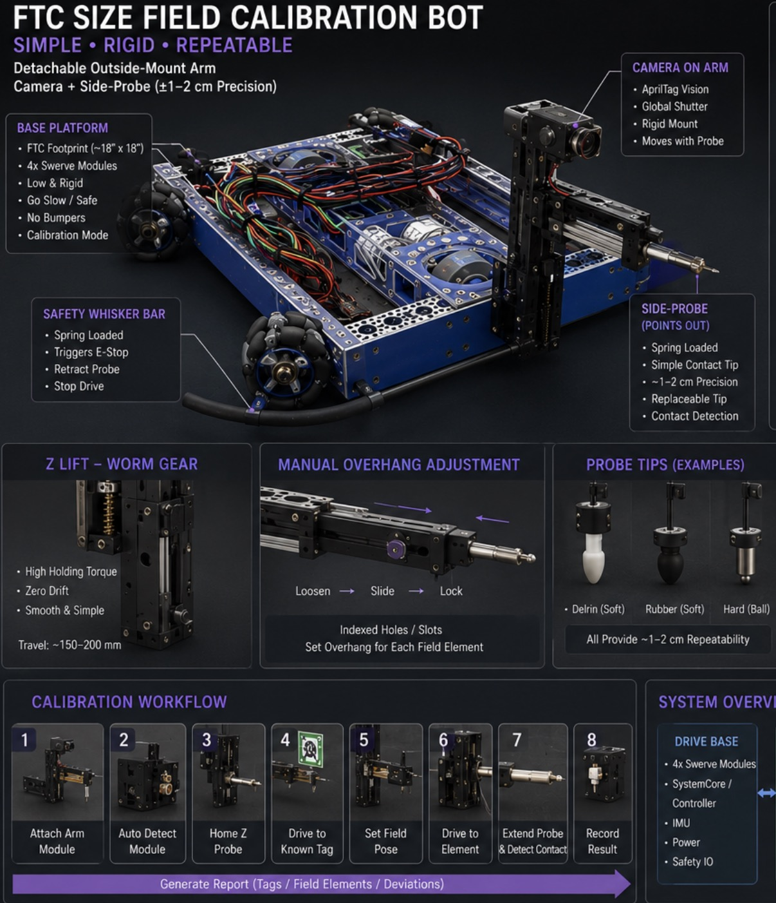
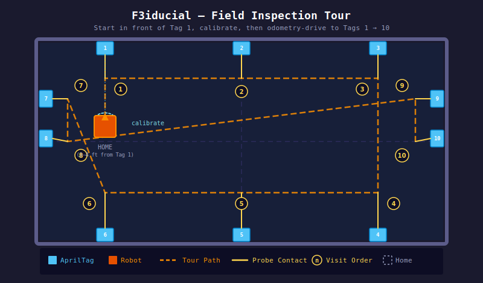
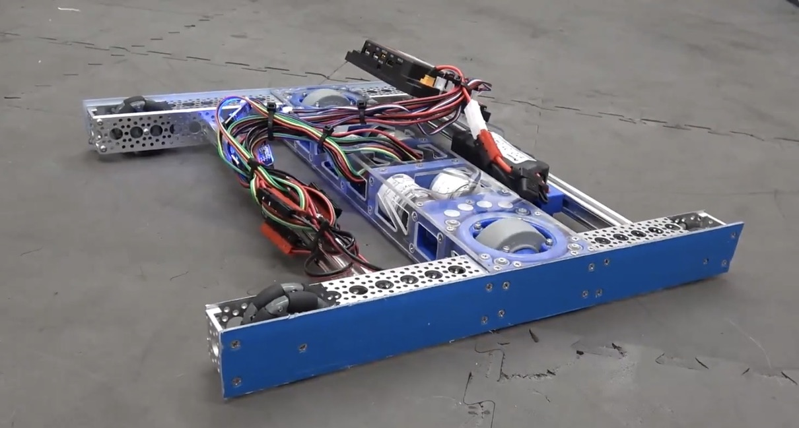
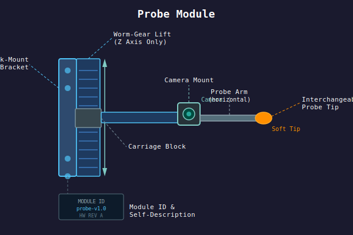

# F3iducial

> FIRST Field Fiducial — Open-source field calibration, localization, and verification tooling for FRC and FTC.

F3iducial is a modular open-source robotics platform combining a compact swerve-drive robot, AprilTag vision, inertial localization, and a detachable probe module to measure and validate real-world field geometry against expected layouts.



**F3iducial is NOT a competition robot. It is a mobile field instrumentation platform.** The goal is to have F3iducial Arm or F3iducial bot (FTC-sized) available for teams to borrow at events, or to build their own based on the open-source design.

See [docs/use-cases.md](docs/use-cases.md) | [docs/architecture.md](docs/architecture.md) | [docs/probe-system.md](docs/probe-system.md) | [docs/contributing.md](docs/contributing.md)

> 📣 **Volunteers wanted — CAD, code, building, electrical, vision, testing, docs, and more.**
> Browse the [`help wanted` issues](https://github.com/BioNanomics/F3iducial/issues?q=is%3Aissue+is%3Aopen+label%3A%22help+wanted%22) and comment on any that interest you. See [Get Involved](#get-involved) below.

---

## Why?

Every robotics team has experienced it: the field was assembled slightly wrong, a wall shifted, an AprilTag moved, autonomous worked at home but not at competition.

Modern FIRST robots depend heavily on accurate field geometry. A few centimeters of error can cause missed autonomous routines, inconsistent path following, inaccurate AprilTag localization, and endless debugging during events.

Today, field verification is mostly tape measures, eyeballing, and guesswork. F3iducial exists to change that.



### Running an Inspection Tour

1. **Place the robot 3–4 ft in front of AprilTag 1**, roughly squared to the wall. Power on and put it in *Tour* mode.
2. **Camera + odometry calibration.** The robot performs a short, gentle in-place motion (forward/back and a small rotation) while keeping Tag 1 in view. This:
   - Resolves the camera intrinsics/extrinsics against a known tag pose.
   - Seeds the field-relative pose estimate.
   - Characterizes wheel odometry scale and heading drift against the vision fix.
3. **Odometry-driven tour.** Once calibrated, the robot drives **slowly** under fused odometry + vision, visiting tags in order: **1 → 2 → 3 → 4 → 5 → 6 → 7 → 8 → 9 → 10**.
4. **Probe at each tag.** The probe is **fixed in the horizontal plane** — it does not extend, retract, or articulate. At each waypoint the robot drives in until the side-mounted probe contacts the tag's mounting surface, adjusting only the probe's **Z height** (worm-gear lift) to align with the tag. The contact pose is recorded and compared to the expected field-layout pose.
5. **Re-localize opportunistically.** Whenever a tag is in clear view at a waypoint, its pose estimate is used to correct accumulated odometry error before continuing.
6. **Stop at Tag 10.** The robot reports per-tag deviations and an overall field-geometry summary.

> **Safety:** all motion during the tour defaults to low speed. On any fault — loss of vision lock beyond tolerance, unexpected odometry divergence, contact/whisker trip, or any other error — the robot **stops all motion immediately and reports the reason**. There is no automatic retract or recovery motion; a human operator decides the next step.

### Camera / Probe Geometry

The localization camera is mounted **below the probe arm and tilted slightly upward** so the tag remains in clear view *right up to the moment of contact* — the probe never occludes the camera, and the tag is observed from below as the probe rises to meet its center.

- **Camera position:** low on the chassis (optical center ≤ ~0.15 m above floor), pitched **+15° to +25°** upward.
- **Probe tip:** above and forward of the camera, on the fixed horizontal arm. The camera-to-tip transform is a rigid, per-module calibration carried in the probe module's self-describing config.
- **Approach:** chassis drives in slowly while the Z-lift positions the tip at the target's center height. The camera maintains tag lock throughout; pose updates are taken **before** Z motion (or with Z briefly held), never during a moving lift.
- **Tilted tags** (e.g., Reefscape reef faces, Crescendo speaker) are approached along the tag's surface normal where geometry allows, with the residual angle recorded rather than mechanically matched.

### Tag Height Coverage (FRC AprilTag history)

F3iducial's Z-lift must reach every AprilTag center used in recent FRC seasons. Approximate published centers:

| Season | Game | Tag group | Center height |
|---|---|---|---|
| 2023 | Charged Up | Grid (1–3, 6–8) | ~18.2 in (0.46 m) |
| 2023 | Charged Up | Double Substation (4, 5) | ~27.4 in (0.70 m) |
| 2024 | Crescendo | Source / Amp (1, 2, 5, 6, 9, 10) | ~53.4 in (1.36 m) |
| 2024 | Crescendo | Speaker (3, 4, 7, 8) — angled | ~57.1 in (1.45 m) |
| 2024 | Crescendo | Stage / Trap (11–16) | ~47–52 in (1.20–1.32 m) |
| 2025 | Reefscape | Reef faces (6–11, 17–22) | ~8.75 in (0.22 m) — very low |
| 2025 | Reefscape | Processor (3, 16) | ~51.25 in (1.30 m) |
| 2025 | Reefscape | Coral Station (1, 2, 12, 13) | ~58.5 in (1.49 m) |
| 2025 | Reefscape | Barge / Cage (4, 5, 14, 15) | ~73 in (1.85 m) — very high |

> Authoritative tag poses are loaded from the vendored WPILib AprilTag layouts in [fields/](fields/) — the table above is a design-envelope reference, not a runtime source.

**Design envelope:**

- **Probe-tip Z travel:** 0.20 m → 1.90 m (covers all FRC AprilTag centers to date with margin).
- **Camera optical center at stowed Z:** ≤ 0.15 m above floor.
- **Camera pitch:** +15° to +25° upward.
- **Challenge:** the Reefscape reef (very low) and barge (very high) within the same season force the largest single-season span (~1.6 m). A two-stage / removable riser column or per-event probe module variants are reasonable mechanical responses; either way the module reports its reachable Z range as part of its self-description.

### Field Configuration

F3iducial does not invent its own field layout files. It uses the same calibrated WPILib field metadata as the broader FRC ecosystem, distributed through the **[refinery-forcefield](https://github.com/BioNanomics/refinery-forcefield)** library (also part of The REFINERY by BioNanomics).

- **Field-image calibration JSONs** (field corners, field size, image reference) for 2023–2026 are vendored in [fields/](fields/), sourced from `refinery-forcefield/editor/fields/`.
- **AprilTag layout JSONs** (per-tag pose, ID, size) are vendored alongside, sourced from WPILib's `apriltag` resources.
- At build time (once the robot code lands), `refinery-forcefield` is consumed as a Gradle dependency:

  ```gradle
  // settings.gradle
  dependencyResolutionManagement {
      repositories { maven { url 'https://jitpack.io' } }
  }

  // build.gradle
  dependencies {
      implementation 'com.github.BioNanomics:refinery-forcefield:v0.1.0'
  }
  ```

  This gives F3iducial a single source of truth for field dimensions and the same coordinate convention (WPILib blue-origin, meters, radians) used by PathPlanner and Choreo.

See [fields/README.md](fields/README.md) for the full manifest and provenance.

---

## Core Workflow

1. Calibrate from a known AprilTag
2. Establish field-relative pose
3. Navigate to expected field elements
4. Probe or inspect those elements
5. Record offsets and deviations
6. Generate reports or correction data

---

## Planned Features

**Localization:** AprilTag localization, odometry fusion, IMU integration, pose estimation

**Inspection:** tag verification, field geometry checks, wall alignment validation, scoring element inspection

**Calibration:** robot-to-field alignment, autonomous offset generation, localization characterization

**Reporting:** deviation heatmaps, inspection logs, field error reports, calibration exports

---

## Hardware

F3iducial supports both FTC-sized and FRC-sized swerve platforms. See [docs/architecture.md](docs/architecture.md) for full mechanical details.

### Swerve Drive



[](https://youtu.be/aETaRclTDDo)

### Probe Module



---

## Project Status

Early concept / proof-of-concept. Currently exploring detachable probe module, swerve localization, AprilTag alignment workflows, field inspection architecture, and calibration data models.

---

## Get Involved

F3iducial is volunteer-driven and open to contributors of all experience levels. Each area below has a dedicated issue — **comment on the ones you'd like to help with**, no commitment required.

| Area | Issue |
|---|---|
| CAD / mechanical design | [#1](https://github.com/BioNanomics/F3iducial/issues/1) |
| Robot code (firmware / controls) | [#2](https://github.com/BioNanomics/F3iducial/issues/2) |
| Tooling, reports, and UI | [#3](https://github.com/BioNanomics/F3iducial/issues/3) |
| Building (mechanical assembly) | [#4](https://github.com/BioNanomics/F3iducial/issues/4) |
| Electrical and wiring | [#5](https://github.com/BioNanomics/F3iducial/issues/5) |
| Vision and AprilTag calibration | [#6](https://github.com/BioNanomics/F3iducial/issues/6) |
| Testing (simulation and on-field) | [#7](https://github.com/BioNanomics/F3iducial/issues/7) |
| Documentation and diagrams | [#8](https://github.com/BioNanomics/F3iducial/issues/8) |

Or browse all open [`help wanted` issues](https://github.com/BioNanomics/F3iducial/issues?q=is%3Aissue+is%3Aopen+label%3A%22help+wanted%22). See [docs/contributing.md](docs/contributing.md) for general guidance.

---

## License

TBD — potential directions: Apache 2.0, MIT, CERN-OHL-S

---

## The Goal

Reliable autonomous behavior starts with reliable field geometry. F3iducial helps teams understand the field they are actually playing on.
