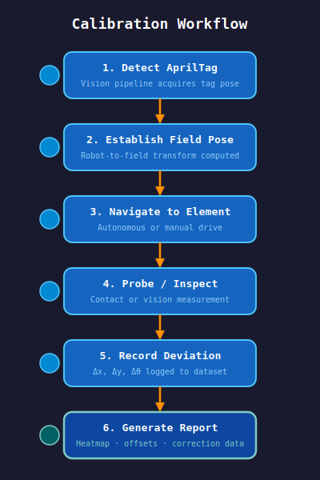
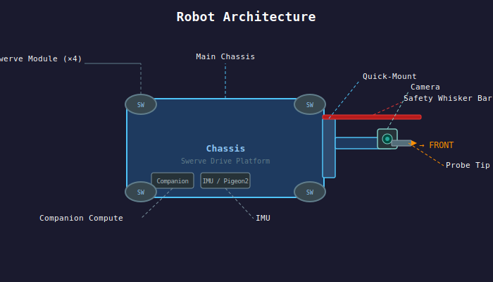

# F3iducial

> FIRST Field Fiducial — Open-source field calibration, localization, and verification tooling for FRC and FTC.

F3iducial is a modular open-source robotics platform combining a compact swerve-drive robot, AprilTag vision, inertial localization, and a detachable probe module to measure and validate real-world field geometry against expected layouts.

**F3iducial is NOT a competition robot. It is a mobile field instrumentation platform.** The goal is to have F3iducial Arm or F3iducial bot (FTC-sized) available for teams to borrow at events, or to build their own based on the open-source design.

See [docs/use-cases.md](docs/use-cases.md) | [docs/architecture.md](docs/architecture.md) | [docs/probe-system.md](docs/probe-system.md) | [docs/contributing.md](docs/contributing.md)

---

## Why?

Every robotics team has experienced it: the field was assembled slightly wrong, a wall shifted, an AprilTag moved, autonomous worked at home but not at competition.

Modern FIRST robots depend heavily on accurate field geometry. A few centimeters of error can cause missed autonomous routines, inconsistent path following, inaccurate AprilTag localization, and endless debugging during events.

Today, field verification is mostly tape measures, eyeballing, and guesswork. F3iducial exists to change that.

### Running an Inspection Tour

1. **Place the robot 3–4 ft in front of AprilTag 1**, roughly squared to the wall. Power on and put it in *Tour* mode.
2. **Camera + odometry calibration.** The robot performs a short, gentle in-place motion (forward/back and a small rotation) while keeping Tag 1 in view. This:
   - Resolves the camera intrinsics/extrinsics against a known tag pose.
   - Seeds the field-relative pose estimate.
   - Characterizes wheel odometry scale and heading drift against the vision fix.
3. **Odometry-driven tour.** Once calibrated, the robot drives **slowly** under fused odometry + vision, visiting tags in order: **1 → 2 → 3 → 4 → 5 → 6 → 7 → 8 → 9 → 10**.
4. **Probe at each tag.** The probe is **fixed in the horizontal plane** — it does not extend, retract, or articulate. At each waypoint the robot drives in until the side-mounted probe contacts the tag's mounting surface, adjusting only the probe's **Z height** (worm-gear lift) to align with the tag. The contact pose is recorded and compared to the expected field-layout pose.
5. **Re-localize opportunistically.** Whenever a tag is in clear view at a waypoint, its pose estimate is used to correct accumulated odometry error before continuing.
6. **Stop at Tag 10.** The robot reports per-tag deviations and an overall field-geometry summary.

> **Safety:** all motion during the tour defaults to low speed. On any fault — loss of vision lock beyond tolerance, unexpected odometry divergence, contact/whisker trip, or any other error — the robot **stops all motion immediately and reports the reason**. There is no automatic retract or recovery motion; a human operator decides the next step.

---

## Core Workflow

1. Calibrate from a known AprilTag
2. Establish field-relative pose
3. Navigate to expected field elements
4. Probe or inspect those elements
5. Record offsets and deviations
6. Generate reports or correction data

---

## Planned Features

**Localization:** AprilTag localization, odometry fusion, IMU integration, pose estimation

**Inspection:** tag verification, field geometry checks, wall alignment validation, scoring element inspection

**Calibration:** robot-to-field alignment, autonomous offset generation, localization characterization

**Reporting:** deviation heatmaps, inspection logs, field error reports, calibration exports

---

## Hardware

F3iducial supports both FTC-sized and FRC-sized swerve platforms. See [docs/architecture.md](docs/architecture.md) for full mechanical details.

### Swerve Drive

### Probe Module

---

## Project Status

Early concept / proof-of-concept. Currently exploring detachable probe module, swerve localization, AprilTag alignment workflows, field inspection architecture, and calibration data models.

---

## License

TBD — potential directions: Apache 2.0, MIT, CERN-OHL-S

---

## The Goal

Reliable autonomous behavior starts with reliable field geometry. F3iducial helps teams understand the field they are actually playing on.
